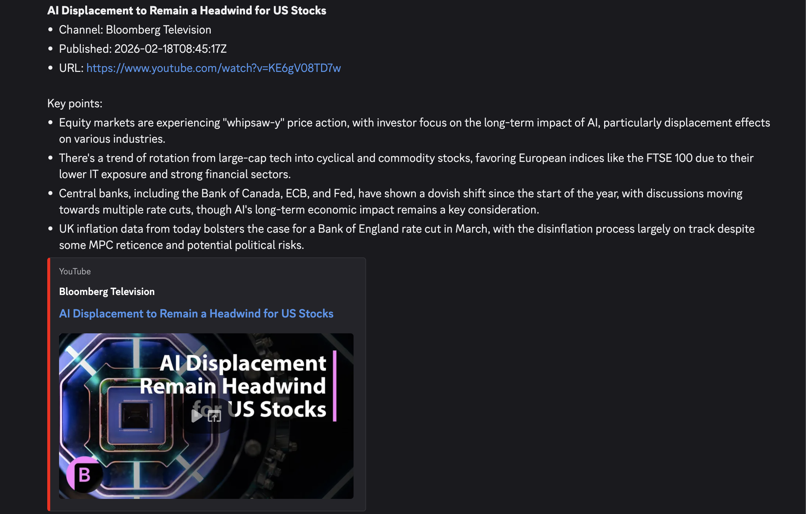

YouTube Summary Notify automatically detects new videos from your favorite YouTube channels, generates concise summaries using Gemini AI, and delivers them straight to your Slack or Discord.

## Features

- **Zero transcript extraction** — Gemini processes video natively
- **Multi-channel monitoring** — watch as many YouTube channels as you want
- **Multi-destination notifications** — send to Slack, Discord, or both
- **Single config file** — change channels, prompts, templates, and model without redeploying
- **Self-hostable** — runs in your own AWS account with your own API keys

## Example Notifications



## How It Works

1. **Detect** new videos via YouTube Data API v3
2. **Summarize** each video with Gemini AI
3. **Notify** all configured destinations with formatted summaries

## Architecture

```
┌──────────────────────────────────────────────┐
│ AWS Account (user-owned)                      │
│                                               │
│  EventBridge            Lambda                │
│  (cron rule) ────────▶ (Docker)               │
│                         │    │                │
│           ┌─────────────┘    │                │
│           ▼                  │                │
│     S3 (config)              │                │
│     DynamoDB (state)         │                │
│     Secrets Manager          │                │
│                              │                │
└──────────────────────────────│────────────────┘
                               │
                 ┌─────────────┼──────────────┐
                 ▼             ▼              ▼
            YouTube       Gemini API    Notification
            Data API                    Webhooks
```

## Cost Estimate
(This information is current as of 2026-02-21.)

Designed to run at minimal cost. Assumes **5 channels, hourly checks, ~30 new videos/month**.

| Service | Monthly Cost | Notes |
|---|---|---|
| **AWS Lambda** | ~$0 | Well within the free tier (400,000 GB-s/month). |
| **EventBridge** | $0 | 720 events/month. Free tier covers 14M. |
| **S3** | ~$0 | Single config file (~1 KB). |
| **DynamoDB** | ~$0 | On-demand, ~30–60 writes/month. |
| **Secrets Manager** | **~$0.40** | Not included in the AWS Free Tier. |
| **YouTube Data API** | $0 | 120 units/day — free quota is 10,000 units/day. |
| **Gemini API** | $0 – ~$1.50 | Free tier covers light usage. Paid: ~$0.02–0.05/video. |

**Estimated total: ~$0.50–$2/month**

## Quick Start

```bash
git clone git@github.com:sohei56/youtube-summary-notify-with-gemini.git
cd youtube-summary-notify-with-gemini

sam build --template-file infra/template.yaml
sam deploy --guided
```

Then store your secrets and upload `config.yaml` — see the [deployment guide](https://github.com/sohei56/youtube-summary-notify-with-gemini/blob/main/docs/02_operation/00_deployment.md) for full instructions.

## Links

- [GitHub Repository](https://github.com/sohei56/youtube-summary-notify-with-gemini)
- [Deployment Guide](https://github.com/sohei56/youtube-summary-notify-with-gemini/blob/main/docs/02_operation/00_deployment.md)
- [Contributing](https://github.com/sohei56/youtube-summary-notify-with-gemini/blob/main/CONTRIBUTING.md)
